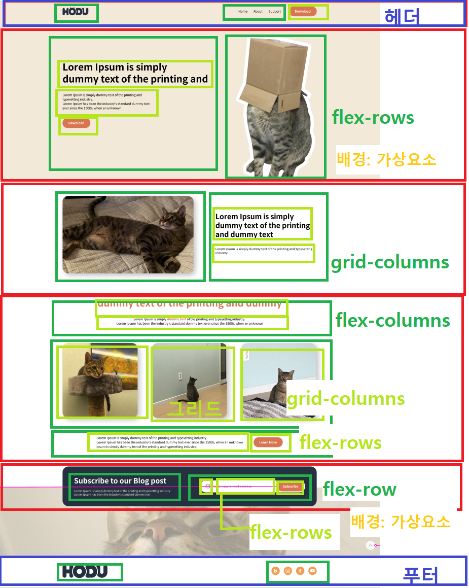
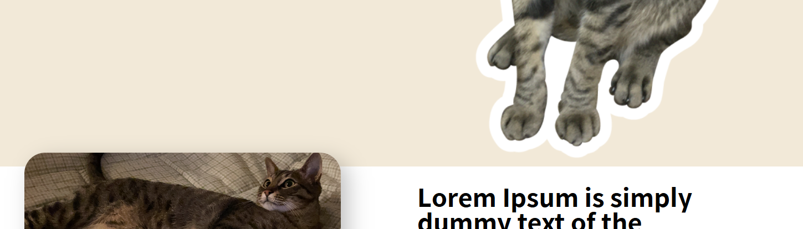

# 🚀zoeshodu
> 고양이 호두에 대한 상세페이지  
> 웹화면과 모바일 반응형 페이지 만들기
> 
## 🛠️사용언어
- HTML
- CSS

## 📂폴더 구조

```text
src/
 ├─ index.html
 ├─ css/
 │ ├─ font.css
 │ ├─ main.css
 │ └─ reset.css
 └─ images/
```
## 시작 전 노트
> 1만 시간에서 마크업 잘못해서 다 뜯어고치느라 시간낭비
> 시작 전 마크업 꼼꼼하게 진행 (한다고 했는데 반응형까지 고려하지 못함)


## 🔍코드리뷰 전 개선하고 싶은 사항

### HTML
- 바디 부분에 헤더, 메인, 푸터로 나누고 각 부분을 다시 div로 감쌌는데, 전체 요소 가운데 정렬을 한번에 주려다보니까 코드가 더러워짐..
  

### css
- 메인 페이지의 고양이 발이 잘리지 않음, 가상요소 배경화면 길이 오류  
  
---

## 💡노트할 부분
- 아래쪽 백그라운드 이미지에서 : 백그라운드 포지션 가로 세로 %로 쓰일 수 있음  
- 

## ⏳미완성 및 모르는 부분
```ul
- [ ] 반응형 : 메뉴 클릭하면 네비게이션 나오는 부분
- [ ] 반응형 : 이미지 3개 스크롤 되는 부분
- [ ] 반응형 : 이미지 호버 시에 컬러 바뀌는 부분
```
